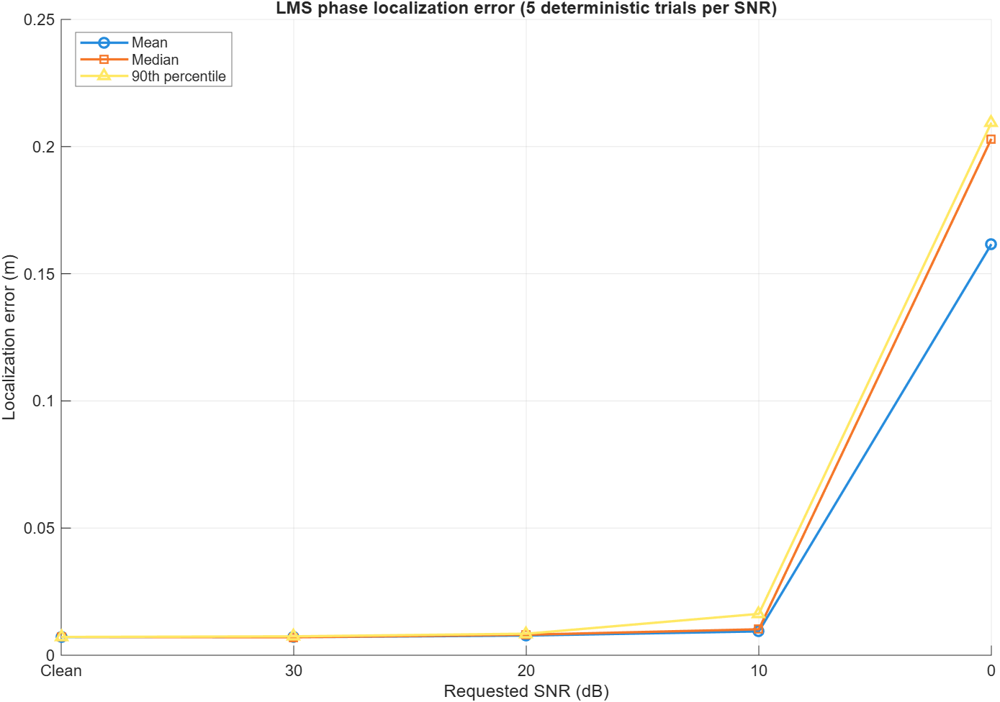
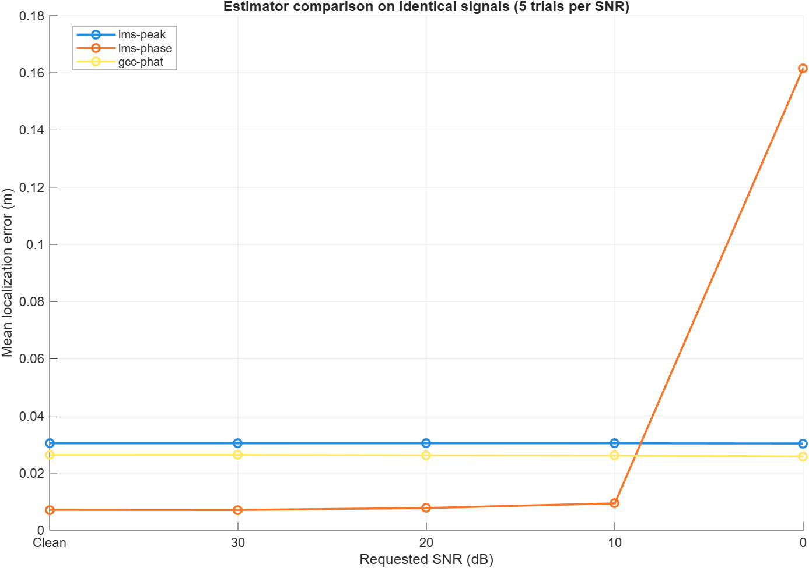

# Microphone Array Localization

[](https://github.com/sasi433/microphone-array-localization/actions/workflows/matlab-ci.yml)
[](https://github.com/sasi433/microphone-array-localization/releases/latest)
[](LICENSE)

A clean-room MATLAB reconstruction and modernization of an academic
sound-source localization simulation.

> **Status:** V1.0.0 portfolio release. One stationary synthetic source is
> localized in a two-dimensional, synchronized, direct-path simulation using
> selectable LMS peak, LMS phase-slope, or independently implemented GCC-PHAT
> TDOA estimation.

This is a focused reproducible signal-processing project. It is not an AI
system, production acoustic-localization product, real-time audio system, or
complete room-acoustics model.

## Selected V1.0 results

The included clean example uses four non-collinear microphones, fractional
propagation delays, seed `5489`, and no additive noise:

```text
Actual position:    [0.150000, 0.220000] m
Estimated position: [0.146064, 0.214196] m
Localization error: 0.007013 m
Solver succeeded:   1 (exit flag 3)
```





The figures compare all three estimators on identical deterministic
microphone signals across five SNR conditions and show one representative
clean trial. They are reproducible simulation results, not general accuracy
claims. See the exact configurations, seeds, trial counts, numerical summary,
and interpretation boundaries in [selected V1.0 results](docs/V1.0_RESULTS.md)
and [limitations](docs/LIMITATIONS.md).

## Requirements

The verified development environment is:

- Windows
- MATLAB R2026a Update 4
- Signal Processing Toolbox (`freqz`)
- Optimization Toolbox (`lsqnonlin`)
- Optional: the official MathWorks MATLAB extension for VS Code

No Audio Toolbox, DSP System Toolbox, Phased Array System Toolbox, Simulink,
Python, Docker, cloud service, machine-learning framework, or microphone
hardware is required.

## Installation and setup

Clone the repository and start MATLAB in its root:

```powershell
git clone https://github.com/sasi433/microphone-array-localization.git
cd microphone-array-localization
matlab -batch "setupProject; disp('Project ready')"
```

`setupProject.m` derives the repository root from its own location and adds
only `src/` for the current MATLAB process. It does not permanently modify
the global MATLAB path.

## Run the basic example

From the repository root:

```powershell
matlab -batch "run('examples/runBasicLMSExample.m')"
```

The script prints the seed, actual and estimated coordinates, localization
error in metres, solver status, and true/estimated TDOAs for every
microphone. It returns `basicLMSResult` in the script workspace.

Regenerate the selected V1.0 documentation figures and local CSV summary with:

```powershell
matlab -batch "run('examples/generateV10Figures.m')"
```

The CSV is written beneath ignored `results/`; the two intentionally selected
figures are written beneath `docs/assets/`. The V0.1 baseline generator remains
available as `examples/generateV01Figures.m`.

## Run tests

Run the complete deterministic MATLAB suite:

```powershell
matlab -batch "run_tests"
```

Run one focused file:

```powershell
matlab -batch "setupProject; results=runtests('tests/testCleanEndToEndLMSLocalization.m'); assert(all([results.Passed]), 'Focused MATLAB tests failed');"
```

The current V1.0 suite contains 124 deterministic MATLAB tests. GitHub Actions
runs the complete suite and code analysis on pushes to `main` and pull requests
targeting `main`, then publishes JUnit test results and Cobertura coverage.

## Processing architecture

```text
validated configuration
        |
        v
seeded synthetic source signal
        |
        v
distance and direct-path arrival times
        |
        v
integer or fractional microphone delays --> optional measured-SNR noise
        |
        v
selected TDOA estimator
        |
        +--> causal alignment --> clean-room LMS FIR --> peak or phase slope
        |
        +--> geometry-bounded GCC-PHAT correlation peak
        |
        v
bounded nonlinear coordinate estimation
        |
        v
coordinates + TDOA errors + metrics + method/solver diagnostics
```

See the complete [architecture](docs/ARCHITECTURE.md). The reusable entry point
is:

```matlab
config = micloc.defaultConfig();
config.tdoaEstimator = 'lms-phase'; % lms-peak | lms-phase | gcc-phat
result = micloc.runLocalizationSimulation(config);
```

The structured result includes configuration and seed, generated and
received signals, microphone coordinates, true arrivals/TDOAs, estimated
TDOAs and errors, actual and estimated source coordinates, localization
metrics, method-specific pair diagnostics, learned LMS filters and histories
when applicable, GCC-PHAT correlations when selected, and solver diagnostics.

Compare every estimator on exactly identical generated microphone signals:

```matlab
comparison = micloc.compareTDOAEstimators(config);
disp(comparison.delayMetricsTable);
```

## Mathematical overview

For source `s`, microphone `m_i`, and speed of sound `c`:

```text
distance_i = ||s - m_i||_2
arrival_i = distance_i / c
TDOA_i,r = arrival_i - arrival_r
```

LMS uses the causal update

```text
y[n] = w_n^T x_n
e[n] = d[n] - y[n]
w_(n+1) = w_n + mu e[n] x_n.
```

A bulk delay allows signed relative delays to be represented by a causal
filter. The learned FIR phase is unwrapped and fitted against normalized
angular frequency; negative slope estimates delay in samples. Every
non-reference TDOA contributes to the bounded nonlinear localization
residual vector.

For GCC-PHAT, the comparison/reference cross-spectrum is normalized by its
magnitude with epsilon protection, transformed back to a signed correlation
lag axis, restricted by microphone separation and sound speed, and refined
locally with quadratic peak interpolation.

See [methodology](docs/METHODOLOGY.md),
[LMS design](docs/LMS_DESIGN.md),
[delay conventions](docs/LMS_DELAY_ESTIMATION.md), and
[fractional-delay design](docs/FRACTIONAL_DELAY_DESIGN.md). The fair
identical-signal workflow and interpretation limits are documented in
[LMS versus GCC-PHAT comparison](docs/ESTIMATOR_COMPARISON.md).

## Repository structure

```text
src/+micloc/   Reusable MATLAB package functions
tests/         Unit and integration tests
examples/      Executable demonstrations and result generators
docs/          Methodology, references, provenance, limitations, results
docs/assets/   Intentionally selected reproducible figures
results/       Untracked local experiment output
```

## Scope and limitations

V1.0 models one stationary synthetic source, synchronized microphones,
known two-dimensional geometry, known sound speed, and direct propagation.
It supports configurable linear or arbitrary valid non-collinear arrays,
integer/fractional delays, optional seeded Gaussian noise, and visible
solver failures. TDOA estimation is selectable between LMS peak, LMS phase
slope, and clean-room GCC-PHAT.

It does not model reflections, reverberation, hardware clocks, microphone
responses, calibration error, multiple sources, motion, 3D localization,
or real recordings. Linear arrays have mirror ambiguity unless constrained
to a known half-plane. LMS convergence and phase accuracy depend on signal
bandwidth and configuration. Read the complete
[limitations](docs/LIMITATIONS.md) before interpreting results.

## Clean-room provenance

The historical project contained `lms.m` and `convm.m` helper files with
uncertain redistribution rights. They and their Git history are excluded.
This repository does not copy, translate, or reconstruct those files,
comments, control flow, or implementation structure. Algorithms were
implemented independently from mathematical definitions and cited sources.

See [provenance](docs/PROVENANCE.md), [references](docs/REFERENCES.md), and the
repository's citation metadata in [`CITATION.cff`](CITATION.cff).

## Release and license

The current portfolio release is
[`v1.0.0`](https://github.com/sasi433/microphone-array-localization/releases/tag/v1.0.0).
The earlier historical-revival milestone remains available as
[`v0.1.0`](https://github.com/sasi433/microphone-array-localization/releases/tag/v0.1.0).

See the [changelog](CHANGELOG.md) for release contents and the
[release checklist](docs/RELEASE_CHECKLIST.md) for the reproducibility and
publication gates used for V1.0.0.

Newly written code, tests, documentation, and original assets in this
repository are licensed under the [MIT License](LICENSE). The license does
not cover excluded historical or third-party source material.
