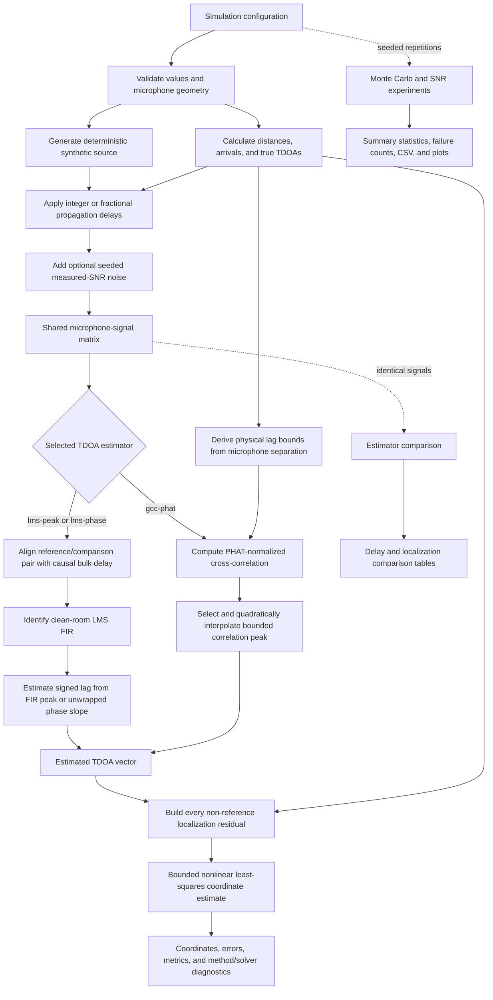

# V1.0 architecture

## System boundary

This repository is a deterministic MATLAB simulation for one stationary
synthetic source and synchronized microphones in a two-dimensional,
direct-path environment. The architecture separates geometry, signal
generation, propagation, TDOA estimation, coordinate estimation, experiment
orchestration, metrics, and presentation so each mathematical stage can be
tested independently.

It is not an artificial-intelligence system, real-time audio application,
hardware integration, production localizer, or room-acoustics model.

## Processing pipeline

The solid path is one call to `micloc.runLocalizationSimulation`. Dashed
paths show experiment orchestration that reuses the same signal-processing
functions. `micloc.compareTDOAEstimators` deliberately supplies an identical
source and microphone-signal matrix to every estimator.

## Module responsibilities

| Layer | Main package functions | Responsibility |
| --- | --- | --- |
| Configuration | `defaultConfig`, presets, `validateConfig` | Define and validate units, algorithms, seeds, bounds, and geometry. |
| Geometry | `createLinearArray`, `calculateDistances`, `calculateArrivalTimes`, `predictTDOAs` | Represent microphone coordinates and ideal direct-path timing. |
| Signal generation | `generateSourceSignal`, `normalizeSignal` | Produce deterministic synthetic broadband sources without changing the global random stream. |
| Propagation | `applyIntegerDelay`, `applyFractionalDelay`, `simulateMicrophoneSignals`, `addNoiseAtSNR` | Generate delayed channels and optional independently seeded noise. |
| LMS TDOA | `alignMicrophonePairForLMS`, `adaptiveLMS`, FIR peak and phase estimators | Identify pairwise FIR responses and convert them to signed delays. |
| GCC-PHAT TDOA | `calculateMaximumTDOASamples`, `estimateDelayGCCPHAT` | Search a geometry-bounded PHAT correlation and refine its peak. |
| Localization | `localizationResiduals`, `estimateSourcePosition`, `calculateLocalizationMetrics` | Fit coordinates using all non-reference TDOAs and preserve solver state. |
| Experiments | `compareTDOAEstimators`, `runMonteCarloTrials`, `runEstimatorSNRComparison` | Reuse identical signals or deterministic trial seeds for fair comparisons. |
| Presentation | plotting and export functions | Render or export explicit results without duplicating algorithms. |

## Data and unit contracts

- Positions and distances are in metres; two-dimensional positions are rows
  of an `N`-by-2 matrix.
- Arrival times and TDOAs are in seconds. Estimated delays may also be
  retained in samples with the sampling frequency recorded in hertz.
- A TDOA entry is `arrival(i) - arrival(reference)`, and the reference entry
  is exactly zero.
- Microphone signals are columns of one samples-by-microphones matrix.
- SNR values are in decibels; positive infinity represents disabled noise.
- Public simulation results retain configuration, seed, ground truth,
  estimates, errors, estimator diagnostics, and solver diagnostics.

## Failure and ambiguity handling

Validation rejects malformed configurations, invalid microphone matrices,
unrepresentable LMS delay ranges, invalid estimator settings, and malformed
TDOA vectors. Estimators report fit and peak diagnostics. Coordinate
estimation preserves the solver exit flag, normalized termination reason,
residual statistics, geometry rank, and linear-array mirror ambiguity.
Non-convergence is returned as a measurable failure rather than converted to
an apparent success.

## Runtime dependencies

V1.0 uses MATLAB, Signal Processing Toolbox, and Optimization Toolbox.
Ordinary `.m` functions under `src/+micloc/` contain the algorithms. Examples
call those functions, tests exercise them directly, and documentation assets
are selected outputs rather than runtime inputs. No Python, Simulink, Audio
Toolbox, DSP System Toolbox, Phased Array System Toolbox, cloud service, or
external web service is required.
