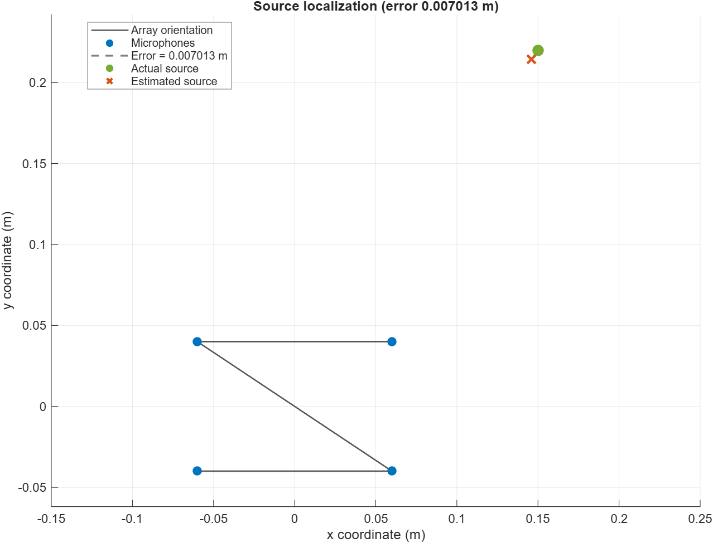
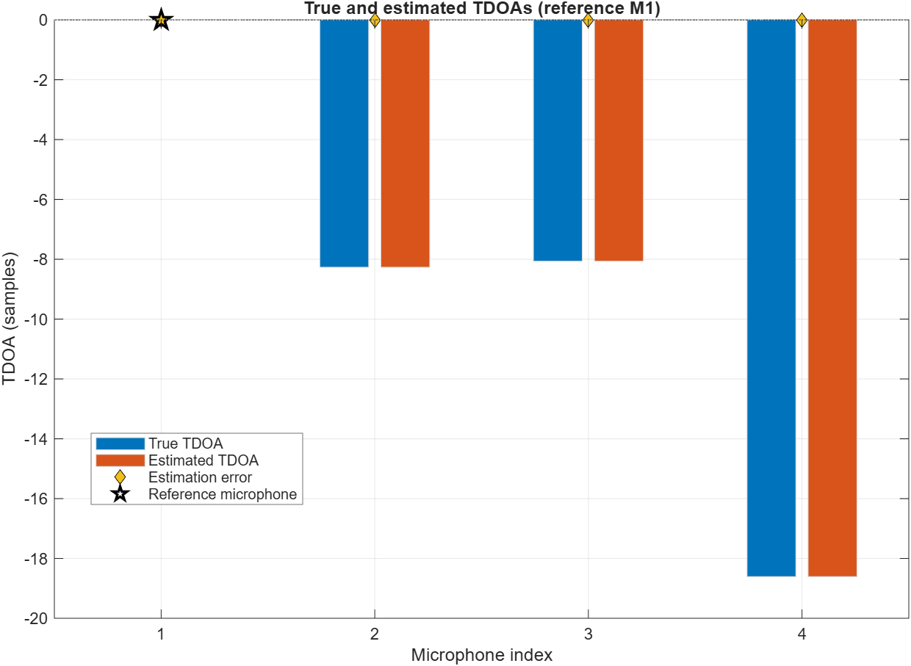
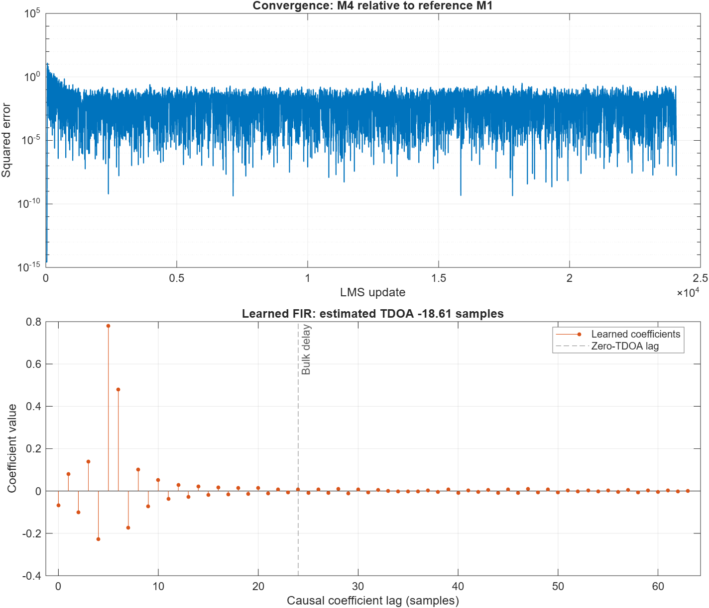

# Reproducible V0.1 selected results

## Reproduction command

From the repository root with MATLAB R2026a and the documented toolboxes:

```powershell
matlab -batch "run('examples/generateV01Figures.m')"
```

The script executes `examples/runBasicLMSExample.m`, calls the reusable plot
functions, and overwrites only the three selected PNGs under `docs/assets/`.
The figures and values below were generated on 13 August 2026 from commit
`f214b34` plus the figure-generation files in this results commit.

## Exact configuration

| Setting | Value |
| --- | --- |
| MATLAB | R2026a Update 4 |
| Sample rate | 48,000 Hz |
| Duration | 0.5 s |
| Random seed | 5489 |
| Source type | Seeded Gaussian broadband signal |
| Microphones | `[-0.06,-0.04]`, `[0.06,-0.04]`, `[-0.06,0.04]`, `[0.06,0.04]` m |
| Actual source | `[0.15, 0.22]` m |
| Reference microphone | 1 |
| Propagation | Direct-path fractional delay, 65-tap Hann-windowed sinc |
| Noise | Disabled |
| LMS | 64 taps, step size 0.003, bulk delay 24 samples |
| Phase fit | Default 2.4–21.6 kHz band, relative magnitude threshold 0.1 |
| Initial coordinate guess | `[0.1, 0.15]` m |
| Coordinate bounds | `[-0.5,-0.5]` to `[1,1]` m |

## Selected numerical output

| Quantity | Value |
| --- | --- |
| Estimated source | `[0.146064, 0.214196]` m |
| Coordinate error | `[-0.003936, -0.005804]` m |
| Euclidean localization error | `0.007013` m |
| Solver status | Succeeded, exit flag 3 |
| True TDOAs | `[0, -8.267639, -8.064723, -18.607960]` samples |
| Estimated TDOAs | `[0, -8.266971, -8.064112, -18.608824]` samples |
| Maximum absolute TDOA error | `0.000864` sample |

The coordinate error is about seven millimetres in this one clean,
well-conditioned synthetic scene. It is not a general accuracy claim. The
phase-delay errors are small, yet the coordinate solver amplifies them
according to geometry and source range. Integer-delay, noisy,
poorly-conditioned, reverberant, and real-device cases behave differently.

## Selected figures

### Geometry and coordinate error



Microphone index order shows the compact non-collinear array orientation.
The dashed segment joins the actual and estimated source coordinates.

### True and estimated TDOAs



The grouped bars compare ground truth and LMS phase-slope estimates. Diamond
markers show signed estimation error; microphone 1 is the exact-zero
reference.

### LMS convergence and learned filter



The upper panel shows squared a-priori error for microphone 4 relative to
the reference. The lower panel shows the learned causal FIR; the bulk-delay
marker is the coefficient location corresponding to zero microphone TDOA.

## Interpretation boundary

These are intentionally selected reproducible outputs, not benchmark
statistics. V0.1 assumes one source, synchronized microphones, known
geometry and sound speed, direct propagation, and synthetic broadband
excitation. See [`LIMITATIONS.md`](LIMITATIONS.md) before interpreting the
figures outside that scope.
